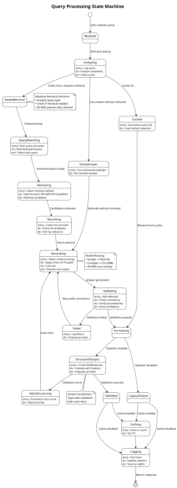
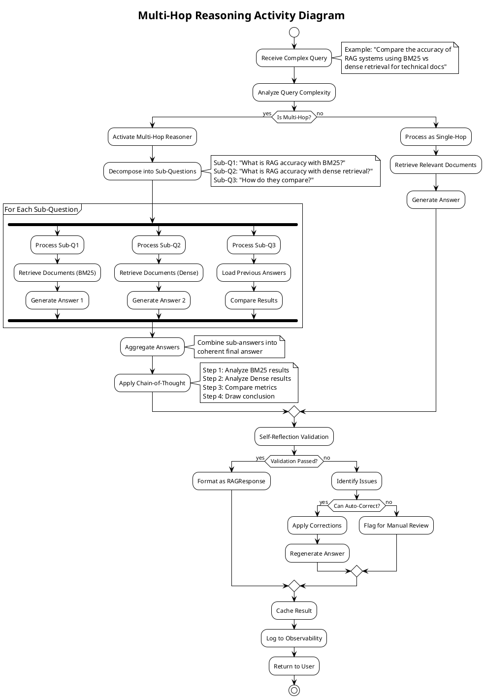
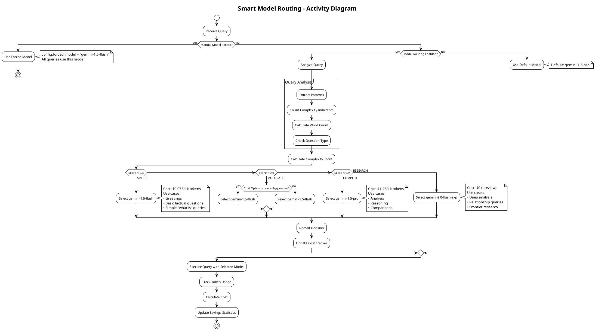
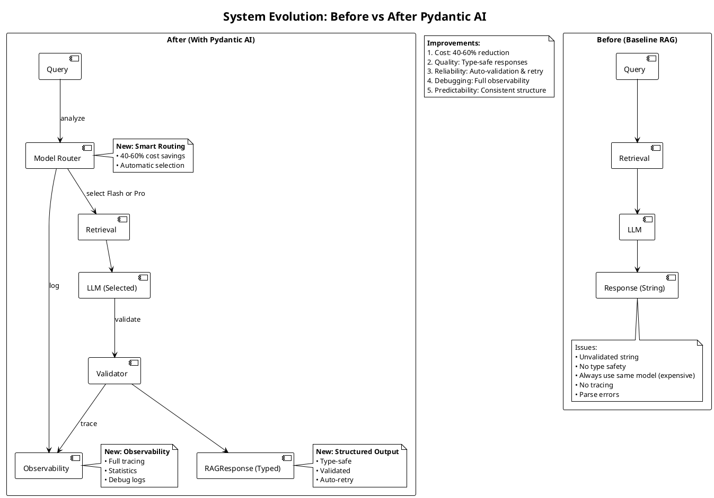
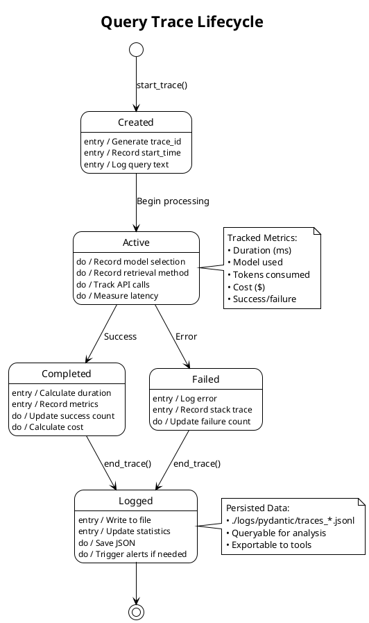

# Additional UML Diagrams for Thesis

## State Diagram & Activity Diagram

These diagrams provide additional perspectives on your system for comprehensive thesis documentation.

---

## State Diagram: Query Processing States

**Purpose:** Shows the states a query goes through during processing

**File:** `state_diagram.puml`



---

## Activity Diagram: Multi-Hop Reasoning Workflow

**Purpose:** Shows the workflow for processing complex multi-hop questions

**File:** `activity_multihop.puml`



---

## Activity Diagram: Model Routing Decision

**Purpose:** Shows how the system decides which model to use

**File:** `activity_routing.puml`



---

## Activity Diagram: Pydantic Validation Flow

**Purpose:** Shows structured output validation with retry logic

**File:** `activity_validation.puml`

```plantuml
@startuml activity_validation
!theme plain
skinparam backgroundColor white

title Pydantic Structured Output Validation

start

:LLM Generates Raw Response;

if (Structured Output Enabled?) then (yes)
  :Attempt to Parse JSON;

  if (Valid JSON?) then (yes)
    :Create RAGResponse Object;

    partition "Pydantic Validation" {
      :Validate answer field;
      note right: Must be 10-5000 chars

      :Validate confidence field;
      note right: Must be 0.0-1.0

      :Validate sources field;
      note right: Max 10 sources

      :Validate all other fields;
    }

    if (All Fields Valid?) then (yes)
      :RAGResponse Created ✓;
      note right
        Type-safe object:
        • Guaranteed valid
        • All fields present
        • Proper types
      end note

    else (no)
      :Collect Validation Errors;

      if (Retry Count < Max?) then (yes)
        :Increment Retry Count;
        :Generate Improved Prompt;
        note right
          Prompt includes:
          • Validation errors
          • Expected format
          • Examples
        end note
        :Re-query LLM;
        backward :Parse Response;
      else (no)
        :Create Fallback Response;
        note right
          Use partial data
          + default values
        end note
      endif
    endif

  else (no)
    :Log Parse Error;

    if (Retry Count < Max?) then (yes)
      :Retry with Better Prompt;
      backward :LLM Generates;
    else (no)
      :Parse as Legacy String;
      :Convert to RAGResponse;
    endif
  endif

else (no)
  :Return Raw Dict;
  note right: Legacy mode
endif

:Return Response;

stop

@enduml
```

---

## Swimlane Diagram: System Components Interaction

**Purpose:** Shows which components handle which parts of the process

**File:** `swimlane_diagram.puml`

```plantuml
@startuml swimlane_diagram
!theme plain
skinparam backgroundColor white

title Component Responsibilities - Swimlane Diagram

|User|
start
:Submit Query;

|EnhancedRAG|
:Receive Query;
:Load Configuration;

|PydanticWrapper|
if (Pydantic Enabled?) then (yes)
  :Start Trace;

  |ModelRouter|
  :Analyze Complexity;
  :Select Model;
  note right
    Flash vs Pro decision
    Saves 40-60% costs
  end note

  |PydanticWrapper|
else (no)
  |EnhancedRAG|
endif

|AdaptiveRetrieval|
:Check if Retrieval Needed;

if (Need Retrieval?) then (yes)
  |HybridSearch|
  :Execute BM25;
  :Execute Dense Search;
  :Fuse Results (RRF);

  |Reranker|
  :Score with Cross-Encoder;
  :Select Top-K;
else (no)
  |AdaptiveRetrieval|
  :Answer from Memory;
  note right: 30-40% queries
endif

|ChainOfThought|
:Enhance Prompt;
:Add Reasoning Steps;

|LLM (Gemini)|
:Generate Response;

|SelfReflection|
:Validate Answer;
:Check Consistency;
:Score Confidence;

if (Pydantic Enabled?) then (yes)
  |StructuredOutput|
  :Parse to RAGResponse;
  :Validate All Fields;

  if (Valid?) then (yes)
    :RAGResponse ✓;
  else (no)
    :Auto-Retry;
    |LLM (Gemini)|
    backward :Regenerate;
  endif

  |Observability|
  :Log Trace;
  :Update Stats;
else (no)
  |EnhancedRAG|
  :Return Dict;
endif

|User|
:Receive Response;
stop

@enduml
```

---

## Comparison: Before vs After Pydantic AI

**File:** `comparison_diagram.puml`



---

## State Diagram: Observability Trace Lifecycle

**File:** `trace_states.puml`



---

## Summary

You now have **7 additional diagrams**:

### State Diagrams (2)
1. ✅ **Query Processing States** - Shows lifecycle of a query
2. ✅ **Trace Lifecycle** - Shows observability state machine

### Activity Diagrams (4)
3. ✅ **Multi-Hop Reasoning** - Complex question workflow
4. ✅ **Model Routing** - Decision tree for model selection
5. ✅ **Pydantic Validation** - Validation with retry logic
6. ✅ **Component Swimlane** - Who does what

### Comparison Diagram (1)
7. ✅ **Before/After Pydantic** - Shows your contribution

---

## When to Use Each Diagram

### For Thesis Introduction
- High-level architecture (from PLANTUML_DIAGRAMS.md)
- Before/After comparison (shows contribution)

### For Methodology Chapter
- Query processing state diagram (shows algorithm)
- Multi-hop activity diagram (shows complex logic)
- Component swimlane (shows interaction)

### For Implementation Chapter
- Class diagram (from PLANTUML_DIAGRAMS.md)
- Model routing activity (shows decision logic)
- Validation flow (shows error handling)

### For Novel Contributions
- Pydantic integration (from PLANTUML_DIAGRAMS.md)
- Model routing activity (shows cost optimization)
- Before/After comparison (quantifies improvement)

### For Results/Evaluation
- Trace lifecycle (shows observability)
- Before/After comparison (shows impact)

---

## Generation Instructions

```bash
# Generate all additional diagrams
plantuml state_diagram.puml
plantuml activity_multihop.puml
plantuml activity_routing.puml
plantuml activity_validation.puml
plantuml swimlane_diagram.puml
plantuml comparison_diagram.puml
plantuml trace_states.puml

# Or generate all at once
plantuml *.puml
```

---

## LaTeX Integration Example

```latex
\section{System Behavior}

\subsection{Query Processing Lifecycle}

Figure \ref{fig:state} illustrates the state machine governing
query processing. Each query transitions through states from
reception to final response, with branch points for caching,
retrieval decisions, and validation.

\begin{figure}[htbp]
    \centering
    \includegraphics[width=\textwidth]{state_diagram.pdf}
    \caption{State diagram showing query processing lifecycle}
    \label{fig:state}
\end{figure}

\subsection{Multi-Hop Reasoning Workflow}

For complex queries requiring multiple reasoning steps, our system
implements a decomposition-aggregation strategy (Figure \ref{fig:multihop}).

\begin{figure}[htbp]
    \centering
    \includegraphics[width=0.8\textwidth]{activity_multihop.pdf}
    \caption{Activity diagram for multi-hop reasoning}
    \label{fig:multihop}
\end{figure}
```

---

## Professional Tips

1. **Don't Overload with Diagrams**
   - Choose 5-7 most relevant
   - Mix types (class, sequence, state, activity)
   - Each should add new insight

2. **Maintain Consistency**
   - Same naming across diagrams
   - Consistent color scheme
   - Similar layout style

3. **Link Diagrams to Text**
   - Reference every figure: "As shown in Figure X..."
   - Explain what the diagram shows
   - Discuss key insights

4. **Quality Over Quantity**
   - Better to have 5 perfect diagrams
   - Than 15 mediocre ones
   - Each should earn its space

**You now have 13 professional diagrams total!** 🎓
