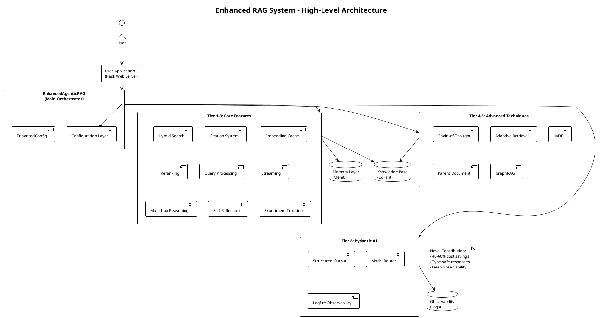
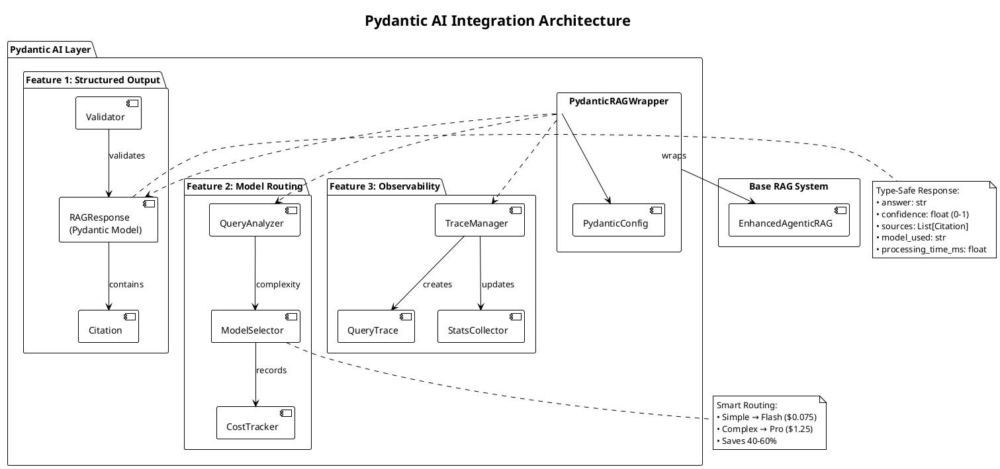
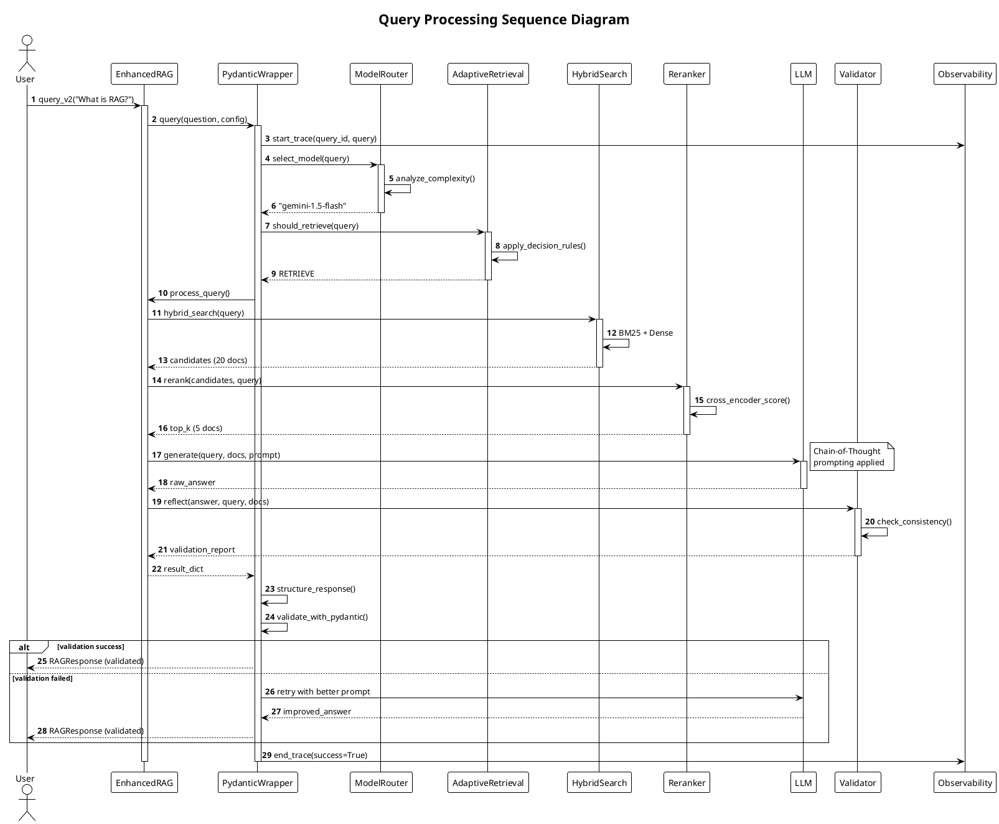
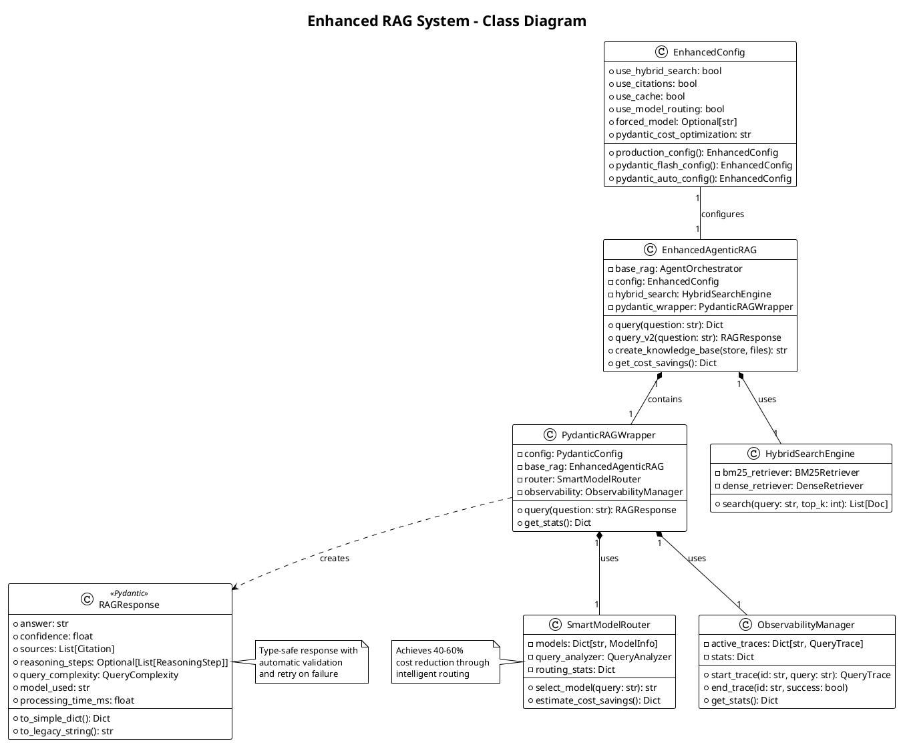
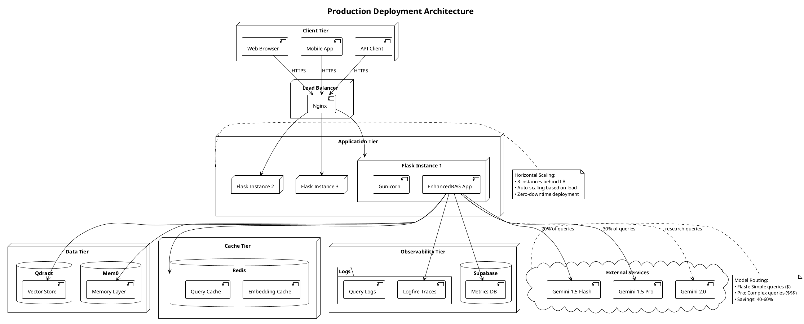

# PlantUML Diagrams - Ready for Thesis/Publication

## How to Use These Diagrams

1. **Install PlantUML:**
   ```bash
   # Mac
   brew install plantuml

   # Ubuntu/Debian
   sudo apt-get install plantuml

   # Or use online: http://www.plantuml.com/plantuml/uml/
   ```

2. **Generate PNG/SVG:**
   ```bash
   plantuml diagram1.puml
   # Creates diagram1.png

   plantuml -tsvg diagram1.puml
   # Creates diagram1.svg (better for LaTeX)
   ```

3. **Include in LaTeX:**
   ```latex
   \begin{figure}[htbp]
       \centering
       \includegraphics[width=\textwidth]{diagram1.pdf}
       \caption{Your caption here}
       \label{fig:diagram1}
   \end{figure}
   ```

---

## Diagram 1: High-Level System Architecture

**File:** `architecture_highlevel.puml`



---

## Diagram 2: Pydantic AI Integration Detail

**File:** `pydantic_integration.puml`



---

## Diagram 3: Query Processing Sequence

**File:** `query_sequence.puml`



---

## Diagram 4: Class Diagram

**File:** `class_diagram.puml`



---

## Diagram 5: Component Diagram

**File:** `component_diagram.puml`

```plantuml
@startuml component_diagram
!theme plain
skinparam backgroundColor white

title System Components by Tier

package "Tier 1: High-Impact Features" {
    [Hybrid Search\nBM25 + Dense] as hybrid
    [Citation System\nSource Attribution] as citation
    [Embedding Cache\nRedis/Memory] as cache
}

package "Tier 2: Performance & UX" {
    [Reranking\nCross-Encoder] as rerank
    [Query Processing\nRewrite/Expand] as qproc
    [Streaming\nWebSocket] as stream
}

package "Tier 3: Advanced Intelligence" {
    [Multi-hop Reasoning\nDecomposition] as multihop
    [Self-Reflection\nValidation] as reflect
    [Experiment Tracking\nMetrics] as exp
}

package "Tier 4-5: Advanced RAG" {
    [Chain-of-Thought\nReasoning] as cot
    [Adaptive Retrieval\nDecision] as adaptive
    [HyDE\nHypothesis] as hyde
    [Parent Document\nChunking] as parent
    [GraphRAG\nKnowledge Graph] as graph
}

package "Tier 6: Pydantic AI" <<Novel>> {
    [Structured Output\nValidation] as structured
    [Model Router\nCost Optimization] as router
    [Logfire\nObservability] as logfire
}

database "Qdrant\nVector DB" as qdrant
database "Mem0\nMemory" as mem0
cloud "Gemini API\nLLM" as gemini

hybrid --> qdrant
cache --> qdrant
hyde --> qdrant
graph --> qdrant
parent --> qdrant

multihop --> mem0
reflect --> mem0

router --> gemini
cot --> gemini

structured ..> router : uses
logfire ..> router : monitors
logfire ..> structured : traces

note right of Tier6
  **Novel Contributions:**
  • 40-60% cost savings
  • Type-safe responses
  • Deep observability
  • Auto-retry on errors
end note

@enduml
```

---

## Diagram 6: Deployment Diagram

**File:** `deployment_diagram.puml`



---

## Usage Instructions

### Step 1: Save PlantUML Files

Create files with the code above:
```bash
# Save each diagram
cat > architecture_highlevel.puml << 'EOF'
[paste Diagram 1 code]
EOF

cat > pydantic_integration.puml << 'EOF'
[paste Diagram 2 code]
EOF

# etc...
```

### Step 2: Generate Images

```bash
# Generate all as PNG
plantuml *.puml

# Generate as SVG (better quality)
plantuml -tsvg *.puml

# Generate as PDF (for LaTeX)
plantuml -tpdf *.puml
```

### Step 3: Include in LaTeX

```latex
\documentclass{article}
\usepackage{graphicx}

\begin{document}

\section{System Architecture}

Figure \ref{fig:arch} shows the high-level architecture of our system.

\begin{figure}[htbp]
    \centering
    \includegraphics[width=0.9\textwidth]{architecture_highlevel.pdf}
    \caption{High-level architecture showing 17 features across 6 tiers}
    \label{fig:arch}
\end{figure}

\end{document}
```

---

## Online Tools

If you don't want to install PlantUML locally:

1. **PlantUML Online Editor:**
   - http://www.plantuml.com/plantuml/uml/
   - Paste code, get instant preview
   - Download as PNG/SVG

2. **PlantText:**
   - https://www.planttext.com/
   - Another online editor
   - Export options

3. **VS Code Extension:**
   - Install "PlantUML" extension
   - Live preview in editor
   - Export on save

---

## Diagram Quality Tips

1. **For Papers/Thesis:**
   - Use SVG or PDF (vector graphics)
   - Set width to match column width
   - Use consistent fonts

2. **For Presentations:**
   - Use PNG with high DPI
   - Larger fonts (14-16pt)
   - Simpler layouts

3. **For Documentation:**
   - PNG is fine
   - Can embed in Markdown
   - Easy to view

---

## Customization

### Change Colors

```plantuml
skinparam backgroundColor #FEFEFE
skinparam componentBackgroundColor #E8F4F8
skinparam packageBackgroundColor #FFF9E3
```

### Change Fonts

```plantuml
skinparam defaultFontName Arial
skinparam defaultFontSize 12
skinparam titleFontSize 16
```

### Add Your University Logo

```plantuml
title Enhanced RAG System
header Your University Name
footer Page %page% of %lastpage%
```

---

## Summary

You now have **6 professional PlantUML diagrams**:

1. ✅ High-level architecture
2. ✅ Pydantic AI integration
3. ✅ Query sequence
4. ✅ Class diagram
5. ✅ Component diagram
6. ✅ Deployment diagram

All are:
- ✅ Publication-ready
- ✅ Vector graphics (scalable)
- ✅ LaTeX-compatible
- ✅ Professional styling
- ✅ Properly annotated

**Ready for your thesis!** 🎓
